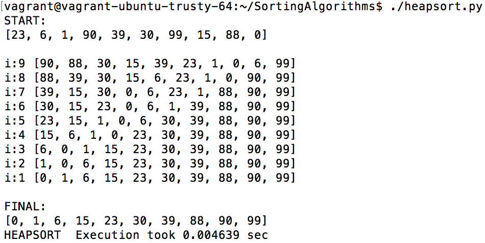

# Sorting Algorithms

<p align="center"></p>

## Welcome
Here are my implementations of popular sorting algorithms in python. The benefits of Python made it easier, more compact, and faster to code than C. As each round of sorting happens, the current state is printed to the screen.

My C sorting algorithms are in a separate GitHub repo.

## Table of Contents
* [About](#about)
* [Requirements](#requirements)
* [Installation](#installation)
* [Usage](#Usage)

## About
This repository contains 7 sorting algorithms with an extra Quicksort variant. The Big Oh Notations are added as a general reference, but this is not the definitive table. Big Oh Notations vary depending on the implementation and in some cases can be subjective. YMMV.

| Algorithm      | Best    | Average |  Worst  |
|:---------------|:--------:|:-------:|:-------:|
| [Bubble sort](https://en.wikipedia.org/wiki/Bubble_sort) | n       |   n^2   |   n^2   |
| [Heap sort](https://en.wikipedia.org/wiki/Heapsort)      | nlog(n) | nlog(n) | nlog(n) |
| [Insertion sort](https://en.wikipedia.org/wiki/Insertion_sort) | n       | n^2     | n^2     |
| [Merge sort](https://en.wikipedia.org/wiki/Merge_sort)     | n       | n^2     | n^2     |
| [Quicksort1 (the traditional way)](https://en.wikipedia.org/wiki/Quicksort)    | nlog(n) | nlog(n) | n^2     |
| [Quicksort2 (using python lists)](https://en.wikipedia.org/wiki/Quicksort)    | nlog(n) | nlog(n) | n^2     |
| [Selection sort](https://en.wikipedia.org/wiki/Selection_sort) | n^2     | n^2     | n^2     |
| [Shellsort](https://en.wikipedia.org/wiki/Shellsort)     | nlog(n) | depends | n^2     |

## Requirements
* Ubuntu 14.04 LTS
* python3 3.4.3
* pycodestyle 2.4.0 (linter - python)

All programs were run on a Vagrant(ubuntu/trusty64) (Virtualbox) environment

## Installation
In your terminal, git clone the directory with the following command:
```
git clone https://github.com/feliciahsieh/SortingAlgorithms.git
```

## Usage
Type the sorting algorithm you want to run in python. All of the programs measure the time it takes for processing the program using the same list of integers. Currently, each sorting algorithm uses the following as the input.
```
[23, 6, 1, 90, 30, 39, 99, 15, 88, 0]
```

The output will look similar to the following:

<p align="center"></p>

You run each program as follows, respectively:

```
./bubblesort.py
./heapsort.py
./insertionsort.py
./mergesort.py
./quicksort1.py
./quickSort2.py
./selectionsort.py
./shellsort.py
```
